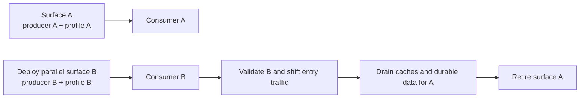

# Migrating to FISE 1.1

FISE 1.1 intentionally removes legacy API and wire compatibility. Treat the
upgrade as a protocol migration, not a drop-in dependency bump.

## Breaking changes

- 0.x magic-less envelopes are rejected.
- `FiseRules`, `defaultRules`, `defaultBinaryRules`, and `FiseBuilder` are gone.
- `decodeLength` and custom salt extraction/placement are gone.
- A single `FiseStringProfile` or `FiseBinaryProfile` owns transform and layout.
- Cipher/backend overrides are no longer operation options.
- Context is validated against the profile contract.
- The string XOR serialization is lossless two-byte UTF-16 plus base64.
- Web Crypto is mandatory; there is no `Math.random` fallback.
- The package is ESM-only and requires Node 20 or newer.

## Code update

Before:

```ts
const envelope = fiseEncrypt(payload, rules, { cipher });
const value = fiseDecrypt(envelope, rules, { cipher });
```

After:

```ts
import {
  defaultStringProfile,
  fiseDecrypt,
  fiseEncrypt
} from "fise";

const envelope = fiseEncrypt(payload, defaultStringProfile);
const value = fiseDecrypt(envelope, defaultStringProfile);
```

For WASM, bind the implementation once:

```ts
const backend = await createWasmXorBinaryCipher({ maxMemoryPages: 1024 });
const profile = withBinaryBackend(defaultBinaryProfile, backend);
```

Tune the retained-page cap for the deployment; 1,024 pages (64 MiB) is the
default. Built-in transform IDs accept only FISE-registered implementations.

For application-specific behavior, write an atomic profile or compile a
manifest. There is no builder compatibility layer.

## Deployment fit

The no-fallback model fits first-party web deployments where one owner controls
the producer, client build, endpoint, and cache namespace. It is also workable
when old and new contracts can run on separate versioned surfaces.

Long-lived mobile clients, offline consumers, durable queues, and third-party
integrations cannot normally move atomically. For those deployments, retain the
old application surface outside FISE until its consumers have drained, or do
not use a profile rotation that they cannot coordinate. Never compensate by
making the 1.1 parser guess among profiles.

## Data migration

No 1.1 API can read 0.x values. Choose one explicit strategy:

### Atomic cutover

Stop old writes, deploy producer and consumer together, invalidate old caches
and queues, and regenerate durable values from their authoritative plaintext
source.

### New endpoint or media contract

Expose 1.1 on a new endpoint, API version, cache namespace, or media type.
Migrate clients deliberately, then retire the earlier surface outside FISE.



The two surfaces use explicit routing or media contracts. Consumer B does not
discover profile B by trying it after profile A fails.

### Offline regeneration

Use an isolated migration tool that still understands the earlier application
format, then write newly generated 1.1 envelopes. Do not ship that legacy
decoder inside the 1.1 runtime.

## Profile rotation after migration

Every decode-relevant change creates a new profile identity. For manifests:

```sh
fise profile diff deployed.json next.json
```

Review changed paths and deploy atomically when
`requiresAtomicRollout` is true. The emitted rotation artifact always has
`legacyFallback: false`.

## Release verification

1. Run `npm test` under Node 20 and the current Node LTS used in production.
2. Run `npm run release:check` and inspect the packed-consumer result.
3. Generate and store manifest artifacts and conformance vectors.
4. Execute real browser/WASM smoke tests under production CSP.
5. Test wrong-profile telemetry and size limits.
6. Confirm no 0.x values remain in caches, queues, databases, or CDN objects.

## Rollback

Rollback means restoring the matching old producer, consumer, endpoint, and
data namespace together. A 1.1 consumer cannot be rolled back independently
while it still receives 1.1 envelopes, and a 1.1 producer cannot safely write
into an old namespace.
