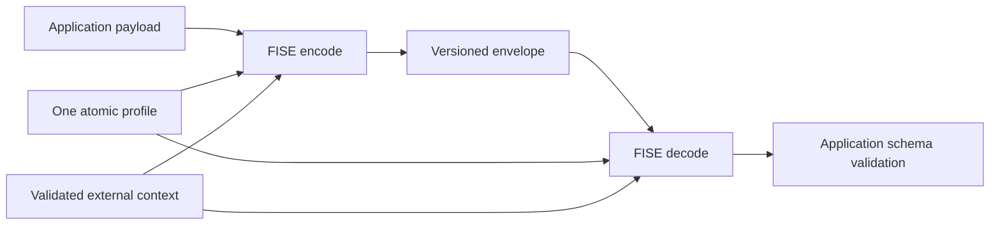
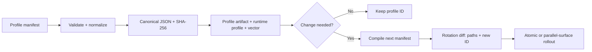
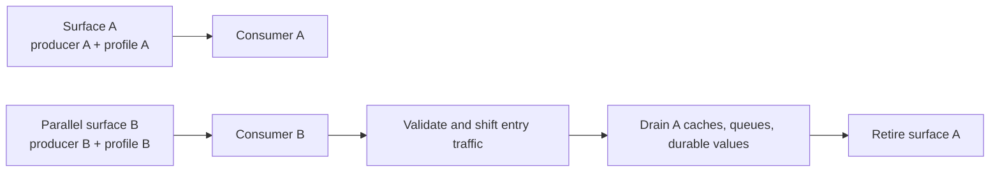

# FISE Engineering Whitepaper — Version 1.1

**Fast Interoperable Structured Envelope: public profile-as-code reversible
framing with a keyless built-in model for client-visible application data**

## Abstract

TLS protects a frontend payload in transit, but a client that is authorized to
use that payload must eventually be able to observe it. Conventional JSON and
byte representations are also immediately intelligible and reusable by generic
tooling. FISE targets this **client adaptation gap**: the difference between
obtaining a valid payload and reproducing the application-specific restoration
path needed to use it.

FISE changes the application-layer representation exchanged by a producer and
an authorized client. Version 1.1 combines explicit wire framing with one
public executable **profile-as-code** compatibility contract, a reversible
transform, public random salt, configurable marker placement, canonical profile
artifacts, deterministic vectors, rollout diffs, binary HTTP helpers, optional
WebAssembly/dedicated-worker byte backends, and an indexed framed-binary layer.
The built-in model is **keyless**: FISE defines no secret-key creation,
exchange, storage, or rotation lifecycle.

FISE is designed to create representation diversity and a maintainable
adaptation step for integrations that otherwise consume stable plaintext
payloads. Whether that step creates useful adaptation cost is an empirical
hypothesis, not a cryptographic work factor and not yet a demonstrated general
result. The current evidence establishes deterministic behavior, bounded
parsing, scoped runtime performance, JavaScript/WASM parity, and independent
Python interoperability for the manifest-compiled binary subset.

The package also implements an optional dedicated-worker transform that keeps
ordinary 1.1 wire bytes unchanged, plus a separately versioned indexed binary
container for range restoration and lazy, pull-driven frame decryption. These
are bounded execution and framing capabilities—not evidence of universal
parallel speedup, HTTP range fetching, streaming input, or lazy JSON parsing.

The built-in repeating-XOR transforms carry their salt in the envelope and
provide neither cryptographic confidentiality nor authenticity. FISE assumes
that an authorized or attacker-controlled client can inspect the decoder and
recover plaintext. TLS, authorization, quotas, and standard authenticated
encryption remain necessary wherever their properties are required.

## 1. Introduction and use case

A first-party frontend must eventually observe any payload it is authorized to
render or process. HTTPS remains necessary because it protects the network path,
but its confidentiality does not continue past the receiving client. The
problem addressed by FISE is therefore not a complete absence of encryption;
it is that stable JSON and byte layouts are often immediately intelligible and
reusable outside the producer's intended application contract.

This paper calls the work between obtaining a valid response and reproducing
the application-specific restoration path the **client adaptation gap**. FISE
gives the application owner an explicit, versioned mechanism for adding and
governing that step without pretending that client-visible data can be kept
secret from the client.

Consider a catalog service and a browser application controlled by one release
owner. Instead of exposing plaintext JSON directly, the service sends a binary
FISE envelope under a versioned media contract. The browser validates one
expected profile, restores UTF-8/JSON, and then applies its ordinary application
schema. A later profile change is reviewed as an atomic compatibility change
and deployed on a parallel endpoint or together with its consumer.

FISE is useful only when:

1. the receiving client is authorized to recover the payload;
2. changing the representation has product value;
3. producer/consumer coupling and resource overhead are acceptable; and
4. normal transport, identity, authorization, and abuse controls remain in
   place.

It is not a suitable boundary for private keys, credentials, payment secrets,
authorization decisions, or regulated-data confidentiality.

The engineering contributions of version 1.1 are the composition of:

- a versioned reversible envelope with deterministic, exact framing;
- a public profile-as-code contract with atomic ownership across representation,
  transform, layout, context, limits, and ID, plus a keyless built-in model;
- canonical manifest compilation with content-derived identity;
- deterministic conformance and first-class rotation artifacts;
- no implicit profile, context, version, or legacy fallback; and
- one implementation surface spanning strings, bytes, HTTP, JavaScript, WASM,
  dedicated workers, indexed byte frames, and a scoped independent Python
  binary reference.

These are protocol- and lifecycle-engineering contributions. XOR, random salt,
headers, markers, manifests, digests, and WASM loops are not claimed as new
algorithms.

The binary design also creates a deliberate execution-model extension path.
For the built-in byte transform, each transformed byte depends only on the byte
at the same absolute position and the corresponding repeating-salt byte. The
worker backend implements that partition while preserving transform identity.
Partial restoration and lazy frame decryption use a stronger boundary: the
opt-in `FISF` container indexes independent inner 1.1 envelopes. Section 7.3
distinguishes this pull-driven frame behavior from transport streaming and lazy
application decoding, which remain future work.

## 2. Claims, terminology, and threat model

### 2.1 Claim classes

This paper uses four claim classes:

- **Implemented**: present in the current source and automated tests.
- **Verified**: executed in a named environment for one exact revision or
  artifact.
- **Hypothesis**: a measurable product effect for which current instrumentation
  exists but controlled outcome evidence does not.
- **Proposed**: future research with no current wire or API promise.

Revision-specific verification belongs in
[RELEASE_EVIDENCE.md](./RELEASE_EVIDENCE.md), not in the stable narrative of
this paper.

### 2.2 Name, keyless model, and operational verbs

FISE expands to **Fast Interoperable Structured Envelope**. “Structured” names
the explicit frame and profile contract without implying cryptographic safety.

The public functions retain `encrypt` and `decrypt` as operational verbs:

- **encrypt** transforms a payload and creates a reversible FISE envelope;
- **decrypt** validates and reverses that envelope; and
- **transform** is the selected reversible operation, whose properties must be
  assessed independently.

The built-in profiles do not provide cryptographic confidentiality,
authenticity, or integrity. That warning is part of the public API documentation
as well as this paper because a consumer may see autocomplete without reading
the threat model.

**Keyless** means that FISE's built-in profiles use no protected secret key and
require no key provisioning, exchange, storage, or rotation. Their varying salt
is public and travels inside the envelope. Keyless describes deployment and
integration mechanics; it is not a security strength.

**Profile as code** means that one executable, versioned compatibility contract
owns the representation, transform, layout, context schema, limits, and public
identity needed for restoration. A profile may come from a canonical manifest
or trusted application callbacks. It is shipped to the authorized client,
assumed observable, and must not be described as a hidden key.

Other terms:

- **client adaptation gap**: the deployment-specific work between obtaining a
  valid payload and reproducing or reusing the restoration path needed to
  consume it;
- **profile**: one public compatibility identity plus representation,
  transform, layout, context schema, and resource limit;
- **marker**: a fixed-width profile-consistency value recomputed from declared
  layout inputs and context;
- **salt**: a varying public transform parameter carried at the envelope tail;
  and
- **rotation**: an atomic producer/consumer move to a different profile ID.

### 2.3 Attacker capabilities and intended effect

A realistic client-side attacker may:

- obtain valid responses through an authorized or compromised account;
- download shipped JavaScript, profile artifacts, and WASM;
- inspect headers, salts, algorithms, and context derivation;
- hook functions before encryption or after decryption;
- inspect WASM inputs, outputs, and linear memory;
- automate the official browser rather than reimplement the protocol; and
- reproduce or modify public transform/profile behavior.

FISE targets the client adaptation gap by breaking direct compatibility with
tooling that expects the original plaintext layout. A deployed profile change
can create a maintenance event for an independently implemented decoder. That
effect must be measured as engineering time, throughput, correctness,
maintenance, and legitimate-client cost—not as bits of security. If automation
hooks the official decoder, profile diversity may add little cost.

FISE 1.1 does not promise secrecy, authenticated integrity, origin proof,
authorization, replay prevention, freshness, DRM, anti-debugging, or a trusted
browser/WASM enclave.

## 3. Design principles and architecture

Version 1.1 is a clean break from earlier designs that exposed separable rules
and transforms, inferred salt length through custom inverses, and accepted
magic-less legacy input. It establishes five boundaries:

1. one atomic profile owns all decode-relevant behavior;
2. one explicit versioned header owns framing and lengths;
3. one tail location owns salt extraction;
4. one recomputed marker replaces inverse marker decoding; and
5. one canonical manifest/artifact path owns reproducible profile rotation.



No compatibility overload or legacy decoder is retained. Upgrade cost is paid
at a declared deployment boundary instead of becoming permanent parser state.
Parsing is fail-closed: the decoder receives one expected profile and never
searches a candidate range, guesses context, or tries an older format.

## 4. Wire protocol

Both string and binary representations follow the same logical frame:

```text
┌────────────── H: header ──────────────┐┌──── transformed payload ────┐┌─ salt ─┐
FISE | 1.1 | profile ID | L | N          X[0:p] | M | X[p:N]             S (L units)
                                             └ marker at profile offset p
```

Equivalently:

```text
E = H || X[0:p] || M || X[p:N] || S
length(E) = headerLength + N + markerSize + L
```

`H` carries magic, exact wire version 1.1, profile ID, salt length `L`, and
transformed length `N`. `M` is a fixed-width marker at profile-selected position
`p`. `S` is always the final `L` units. The string fixed header is 22 ASCII code
units; the binary fixed header is 13 bytes. Both are followed by an ASCII
profile ID of at most 63 characters.

The decoder:

1. validates one profile/context snapshot and the stricter envelope limit;
2. requires magic and exact version 1.1;
3. parses and matches the expected profile ID;
4. checks salt range and one exact total-length equation;
5. computes marker position from declared lengths and context;
6. recomputes and compares the marker;
7. takes the declared tail salt, reconstructs transformed data, and runs the
   profile-owned reverse transform; and
8. validates the transform output representation.

Unknown versions, old magic-less input, truncation, trailing data, wrong
profiles, and marker mismatches fail with typed error codes.

### 4.1 Marker failure model

The marker is a bounded consistency signal, not a checksum, MAC, or
authentication tag:

| Condition | Primary detection | What the marker adds |
| --- | --- | --- |
| Wrong version or profile ID | Header | Nothing |
| Truncation or trailing data | Exact length | Nothing |
| Wrong context/layout under the same ID | Recomputed value/location | Partial detection; mappings and observed bytes can collide |
| Same-length payload or salt mutation | External integrity/schema control | Not generally detected |
| Deliberate rewrite with the public profile | MAC/AEAD/signature outside FISE | Not prevented |

There is no profile-independent false-acceptance probability. A wrong position
reads application-dependent transformed bytes, not necessarily uniformly random
values. Marker width therefore trades framing overhead and representational
capacity against deployment-specific accidental-match behavior; it must not be
reported as security bits.

### 4.2 Default transforms

The default string transform XORs JavaScript UTF-16 code units with a repeating
salt, serializes each result as two big-endian bytes, and emits canonical
base64. It preserves lone surrogate code units. An implementation in another
language must model 16-bit code units rather than Unicode scalar values; the
binary/UTF-8 path is the preferred cross-language surface.

The default binary transform repeats XOR directly over `Uint8Array`. It avoids
base64 and can use either the reference JavaScript loop or its byte-compatible
WASM backend.

Salt selection and content use `globalThis.crypto.getRandomValues`, including
rejection sampling for inclusive ranges and the string alphabet. Salt remains
public and does not turn repeating XOR into cryptography.

The normative grammar is in [SPEC.md](./SPEC.md).

## 5. Atomic profile-as-code model

```text
FiseProfile
├── public ID and optional manifest digest
├── representation: string | binary
├── transform: stable semantic ID + forward/reverse implementation
├── layout: salt range + marker size + marker + offset
├── external-context contract: timestamp + typed metadata
└── resource limit: maximum envelope length
```

The tree is an executable compatibility contract, not a secret-key container.
Treating the profile as code makes changes reviewable, testable, content-bound
when compiled from a manifest, and deployable as one atomic unit. Because the
authorized client receives the profile behavior, the model assumes that an
attacker can inspect, hook, or reproduce it.

Encryption and decryption accept the profile directly. An operation cannot
substitute an unrelated transform. Definition helpers validate and freeze owned
copies; every operation consumes one immutable profile/context snapshot.

When an application derives timestamp context from Unix time,
`resolveFiseTimeWindow` standardizes mathematical-floor bucketing with an
explicit duration, alignment origin, and half-open interval. It reads no clock
and leaves the returned integer external to the envelope. This is a correctness
and interoperability helper, not an expiry, freshness, or replay mechanism;
producer and consumer still coordinate one exact context value.

The shared runtime interface contains two materially different profile classes:

| Class | Source of behavior | Identity | Interoperability claim |
| --- | --- | --- | --- |
| Manifest-compiled profile | Declarative `fise.profile/1` schema | Canonical SHA-256 content identity | Portable across implementations of that declared subset |
| Application-defined runtime profile | Trusted callbacks | Developer-assigned ID | Local contract; portability is not implied |

These are documentation classes, not extra TypeScript types. Finite vectors can
detect drift in callbacks but cannot prove arbitrary callback equivalence.
Handwritten IDs rely on developer discipline.

Backend substitution is narrower than profile substitution.
`withBinaryBackend` requires the same transform ID and runs deterministic
semantic, round-trip, output-ownership, and mutation checks. Built-in transform
IDs accept only implementations registered by FISE. The JavaScript and WASM
byte loops both implement `fise.xor.u8.v1`; changing the backend does not change
the envelope profile.

## 6. Profile compiler and lifecycle

The `fise.profile/1` compiler covers built-in transforms, fixed-width base-N or
unsigned markers, affine offsets, typed context, and resource limits. It:

1. rejects unknown, inconsistent, or type-coerced fields;
2. normalizes every default;
3. canonicalizes the normalized manifest;
4. hashes its UTF-8 bytes with SHA-256;
5. derives an ID containing a 128-bit digest prefix;
6. emits a deeply frozen artifact carrying the full digest; and
7. validates transform/layout behavior and generates deterministic vectors.

Normalized manifests contain only safe integers and schema-restricted ASCII
strings/keys. Object keys are ordered, compiler-declared commutative terms are
sorted, arrays otherwise retain order, JSON is emitted without insignificant
whitespace using ECMAScript primitive serialization, and the resulting string
is UTF-8 encoded before hashing. This restricted scheme is compatible with the
JSON Canonicalization Scheme [6], while FISE's exported helper is not presented
as a general-purpose JCS implementation outside the manifest schema.



Artifacts prove content equality, not author identity or approval. They are
unsigned and require normal source control, release signing, and deployment
authorization for provenance.

## 7. Implementation and conformance

### 7.1 Binary HTTP surface

`fise/http` serializes UTF-8 and JSON through the binary envelope. Writers emit:

```text
application/vnd.fise; version=1.1; profile="..."
```

Readers require exact media type, version, and profile. With an active bound,
they count Fetch-exposed body chunks and request cancellation on overflow.
Identity `Content-Length` supplies an early bound and exact-length check. For a
content-coded response, Fetch may expose decoded bytes while retaining the
compressed representation length in headers; FISE therefore validates that
header syntactically without comparing it to decoded envelope length.

### 7.2 WebAssembly backend

The optional embedded WASM module contains only a byte XOR loop. Compilation is
cached, instances own isolated linear memory, results are copied out, and the
used window is cleared best-effort. Memory grows in 64 KiB pages and retains its
bounded high-water mark until the instance is discarded. The default cap is
1,024 pages (64 MiB); parsing, randomness, profiles, input/output copies, and
other allocations remain in TypeScript.

WASM is a performance backend, not an enclave or anti-analysis boundary.

### 7.3 Execution-model extension path

The implemented boundaries are deliberately narrower than their informal
feature names:

| Capability | Implemented contract | Explicit non-claim |
| --- | --- | --- |
| Parallel encrypt/decrypt—more precisely, parallel binary transform | `createParallelXorBinaryCipher()` retains dedicated workers, partitions `fise.xor.u8.v1` by absolute offset, snapshots caller bytes, supports cancellation/close, and is byte-compatible with ordinary 1.1 envelopes | No measured universal speedup or automatic support for arbitrary transforms, SIMD, or shared-memory threads |
| Partial or range restoration | `FISF` 1.0 indexes bounded independent inner 1.1 envelopes; the range API validates the outer index and restores only intersecting frames | Not direct slicing of an ordinary 1.1 envelope and not an HTTP Range fetcher |
| Lazy frame decrypt / progressive restoration | An async generator defers each independent inner-envelope decrypt until its indexed byte frame is requested, with frame-level backpressure | The complete container is already in memory; output is bytes, not lazy JSON or partially safe application values |

The worker backend preserves the existing logical transform ID and ordinary
envelope bytes. It does not make profile validation, marker work, envelope
assembly, or JSON decoding parallel. Inputs below an explicit threshold use the
local JavaScript loop, and the backend retains resources until `close()`.

The framed format uses distinct `FISF` magic and version 1.0 rather than
overloading the `FISE` 1.1 decoder. Its header binds one profile ID, frame size,
total plaintext length, frame count, and fixed-width absolute index. Every
selected inner envelope still passes normal 1.1 validation and must restore to
its declared frame position. Unselected inner envelopes are intentionally not
validated by a disjoint range request.

Arbitrary application-defined transforms are never inferred to be sliceable;
framing obtains independence by applying the complete selected profile to each
frame. Incremental transport, remote range acquisition, and incremental JSON
parsing remain proposed. The exact grammar and observation boundary are in
[FRAMED_BINARY.md](./FRAMED_BINARY.md), with remaining research in
[ROADMAP.md](./ROADMAP.md).

### 7.4 Conformance evidence

The TypeScript suite covers canonical vectors, version/profile/length/marker
failures, context and resource limits, full-byte and arbitrary UTF-16 property
sweeps, malformed fixed headers, strict manifest validation, artifacts,
rotation, HTTP behavior, WASM boundaries, and JS/WASM parity.

A standard-library-only Python implementation independently verifies a
manifest-compiled binary artifact, reproduces its digest/profile ID, decodes a
TypeScript-generated vector, and emits the same envelope bytes from its fixed
conformance salt. This demonstrates cross-language interoperability for that
declared subset only. It does not establish portability of handwritten
callbacks or the JavaScript-specific string surface.

See [CONFORMANCE.md](./CONFORMANCE.md) and the
[Python reference](../reference/python/README.md).

## 8. Evaluation

### 8.1 Runtime and wire cost

FISE separates raw transform cost, complete round-trip cost, and known-decoder
JSON parsing. The benchmark commands emit machine-readable mean, median, P95,
P99, standard deviation, throughput, warmup/iterations, and wire size.

In one scoped Node `v22.14.0` macOS arm64 run, a 1 MiB full binary round trip
measured 3.490 ms mean / 3.793 ms P95 in JavaScript and 1.378 ms mean / 1.449 ms
P95 with WASM. These are local summary statistics, not a universal crossover or
browser/device claim.

Binary framing adds `13 + profileIdBytes + markerBytes + saltBytes`; the default
profile therefore adds 44–133 bytes. The default string representation encodes
two bytes per UTF-16 code unit as base64, approaching about 2.667x for large
ASCII input before fixed framing and transport compression. String and binary
wire costs must not be conflated.

“Fast” means a design objective with linear transforms, bounded parser work, and
scoped measurements. Browser main-thread, worker transfer/startup, allocation,
GC, mobile/device, power, compression, and end-to-end application latency remain
deployment measurements.

The repository also provides dedicated framed and worker suites. Framed cases
separate full restoration, aligned/unaligned selective ranges, iterator
creation, first pull, fixed pulls, and complete drain. Worker cases separate
startup, first operation, warm local/worker paths, representative `FISF`
restoration, and close. Machine-readable output records raw samples when an
output path is supplied plus explicit `notMeasured` boundaries.

These measurements remain revision-, runtime-, and machine-scoped. Aggregate
worker timing does not isolate transfer from copying and execution; a Node
throughput result is not browser UI responsiveness or a universal crossover
claim. See [PERFORMANCE.md](./PERFORMANCE.md) for methodology and named runs.

See [PERFORMANCE.md](./PERFORMANCE.md).

### 8.2 Adaptation hypothesis

The bundled runtime benchmark compares plaintext JSON, base64 JSON, a minimal
versioned binary JSON envelope, and FISE with already known profiles. It proves
neither human reverse-engineering cost nor maintenance benefit.

The controlled protocol separates initial integration, profile rotation, and
official-client instrumentation. It includes the closest baseline—a versioned
custom binary/media envelope—so the study can distinguish generic non-JSON cost
from FISE's profile lifecycle. Until independent participants complete that
study, adaptation cost remains a hypothesis. A null or small effect is a valid
result and must narrow the product claim.

See [ADAPTATION_EVALUATION.md](./ADAPTATION_EVALUATION.md).

### 8.3 Name-to-evidence status

| Name component | Version 1.1 evidence |
| --- | --- |
| **Fast** | Scoped Node latency/throughput and wire measurements; not universal device evidence |
| **Interoperable** | Normative wire contract, vectors, JS/WASM parity, and independent Python compiled-binary evidence; not every profile/language |
| **Structured** | Explicit version/profile/length framing, deterministic parsing, typed failures, and atomic profile lifecycle |

## 9. Security analysis and limitations

Version/profile headers prevent accidental decoder drift. Exact lengths remove
heuristic scanning and parser ambiguity. Atomic profiles reduce configuration
mix-and-match. Context schemas and resource bounds make failure explicit.
Canonical artifacts improve rollout governance.

None of those properties establish confidentiality or authenticity. An
attacker controlling an authorized client can observe plaintext and reproduce
public logic. A party that can rewrite an envelope and execute the profile can
create another consistent envelope. The public marker does not cover every
payload/salt byte. WASM memory is observable. Profile artifacts are unsigned.

Deployments retain HTTPS, authentication, server-side authorization, quotas,
rate limits, anomaly detection, cache policy, schema validation, revocation,
and standard cryptography where keys can be protected. The complete boundary is
in [SECURITY.md](./SECURITY.md).

## 10. Related work and closest baseline

JSON [1], CBOR [2], and Protocol Buffers [3] define textual or binary data
representations with substantially broader multi-language ecosystems than
FISE. CBOR includes deterministic-encoding guidance but does not create a FISE-
style profile identity or rollout artifact by itself. Protocol Buffers owns
schema evolution rules, including explicitly safe and unsafe changes, rather
than FISE's arbitrary layout/context profile.

HTTP already separates media type from content coding and supports media-type
parameters and negotiation [4, 5]. FISE's media contract uses those mechanisms;
it does not claim to invent them. JSON canonicalization work [6] supplies the
closest standard foundation for reproducible manifest bytes.

Moving-target defense changes or disrupts a system's attack surface [7], while
software obfuscation transforms programs to raise analysis cost [9]. FISE is
only adjacent to those areas: it rotates an application representation while
shipping the authorized decoder, and it makes no general system-defense or code-
secrecy claim. OWASP's automated-threat taxonomy [8] supplies problem vocabulary
for scraping and other unwanted automation but does not make representation
changes sufficient controls.

Authenticated envelopes such as JWE use authenticated encryption for
confidentiality and integrity [10]. White-box cryptography studies key-bearing
cryptographic implementations in hostile execution environments [11]. FISE is
not in either class because its built-in transform has no protected secret and
its envelope has no authentication tag.

| Category | Primary purpose | Evolution identity | Content-derived identity | Cryptographic secrecy/integrity | Current cross-language evidence |
| --- | --- | --- | --- | --- | --- |
| Plain JSON | Text data interchange | Application-owned | No | No | Broad |
| Base64 wrapper | Binary-to-text representation | Application-owned | No | No | Broad |
| CBOR | Compact binary data model | Tags/application profile | Not inherent | No | Broad |
| Protocol Buffers | Schema-based serialization | Schema/field evolution | Not inherent | No | Broad |
| HTTP media/content coding | Representation labeling/transformation | Media type, parameters, registries | No | No | Broad |
| FISE 1.1 | Governed reversible application envelope | Atomic profile + wire version | Compiled profiles only | No built-in claim | TypeScript/WASM plus Python compiled-binary subset |

The closest baseline is a custom media type plus versioned binary serialization
and a canonical manifest. A disciplined application can reproduce many FISE
properties from those components. FISE's narrower contribution is their
integrated contract: one profile owns all decode behavior, declarative behavior
is bound to content identity, parsing is exact and fail-closed, and vectors plus
rotation diffs span the supported surfaces. Whether that integration produces
meaningful adaptation benefit remains the open empirical question.

This comparison establishes positioning, not an exhaustive systematic review
or priority claim.

## 11. Compatibility and deployment

Version 1.1 removes all 0.x decoding. Producers and consumers upgrade together
or use a new endpoint, API version, cache namespace, or media contract. Cached,
queued, and durable envelopes must be invalidated or regenerated.

The no-fallback model is best suited to first-party web deployments where one
owner controls producer and client releases. Long-lived mobile clients, offline
consumers, and third-party integrations require parallel versioned surfaces or
may be a poor fit.



This is application-level blue-green orchestration. Each surface still selects
one exact profile; no decoder tries A and then falls back to B.

Recommended deployment sequence:

1. classify data and confirm the client may recover it;
2. compile and review one profile artifact and vector;
3. set transport, profile, caller, and WASM limits;
4. test the release artifact under target runtimes and production CSP;
5. deploy atomically or behind a parallel versioned surface;
6. validate restored application payloads; and
7. monitor typed errors, latency, failure rate, and measured adaptation outcome.

See [MIGRATION_V1_1.md](./MIGRATION_V1_1.md).

## 12. Conclusion

FISE 1.1 turns a loose reversible layout into an explicit protocol and profile
lifecycle. Atomic ownership, exact headers, marker recomputation, bounded
failure semantics, canonical artifacts, rotation diffs, binary HTTP helpers,
JS/WASM parity, and a scoped independent Python reference improve correctness
and operability.

Its position-separable built-in binary transform now has a dedicated-worker
backend that preserves ordinary 1.1 bytes. The distinct indexed `FISF` layer
adds bounded range restoration and lazy, pull-driven frame decryption.
Transport-aware ranges, incremental input, and lazy application decoding remain
explicit research directions rather than implications of those APIs.

Its strongest defensible claim is precise: FISE is a governed public
profile-as-code mechanism for reversible representation diversity, with
keyless built-in transforms and an adaptation effect that can be measured. It
is not a new cipher, a substitute for cryptography, or proof that a
client-visible decoder imposes meaningful cost in every deployment.

## Artifact appendices

- **Appendix A — test matrix:** [CONFORMANCE.md](./CONFORMANCE.md)
- **Appendix B — runtime/browser/package records:**
  [RELEASE_EVIDENCE.md](./RELEASE_EVIDENCE.md)
- **Appendix C — conformance vectors:** [CONFORMANCE.md](./CONFORMANCE.md)
- **Appendix D — adaptation-study protocol:**
  [ADAPTATION_EVALUATION.md](./ADAPTATION_EVALUATION.md)

## References

1. [RFC 8259 — The JavaScript Object Notation Data Interchange Format](https://www.rfc-editor.org/info/rfc8259)
2. [RFC 8949 — Concise Binary Object Representation](https://www.rfc-editor.org/info/rfc8949)
3. [Protocol Buffers proto3 language guide and message evolution](https://protobuf.dev/programming-guides/proto3/)
4. [RFC 6838 — Media Type Specifications and Registration Procedures](https://www.rfc-editor.org/info/rfc6838)
5. [RFC 9110 — HTTP Semantics](https://www.rfc-editor.org/info/rfc9110)
6. [RFC 8785 — JSON Canonicalization Scheme](https://www.rfc-editor.org/info/rfc8785)
7. [NIST SP 800-160 Volume 2 Revision 1 — Cyber Resiliency Engineering Framework](https://doi.org/10.6028/NIST.SP.800-160v2r1)
8. [OWASP Automated Threats to Web Applications](https://owasp.org/www-project-automated-threats-to-web-applications/)
9. [Collberg, Thomborson, and Low — Manufacturing Cheap, Resilient, and Stealthy Opaque Constructs](https://doi.org/10.1145/268946.268962)
10. [RFC 7516 — JSON Web Encryption](https://www.rfc-editor.org/info/rfc7516)
11. [Chow, Eisen, Johnson, and van Oorschot — White-Box Cryptography and an AES Implementation](https://link.springer.com/chapter/10.1007/3-540-36492-7_17)
12. [WebAssembly Core Specification](https://www.w3.org/TR/wasm-core/)
13. [WebAssembly JavaScript Interface](https://www.w3.org/TR/wasm-js-api-2/)
14. [Content Security Policy Level 3](https://www.w3.org/TR/CSP3/)
15. [Web Cryptography Level 2](https://www.w3.org/TR/WebCryptoAPI/)
